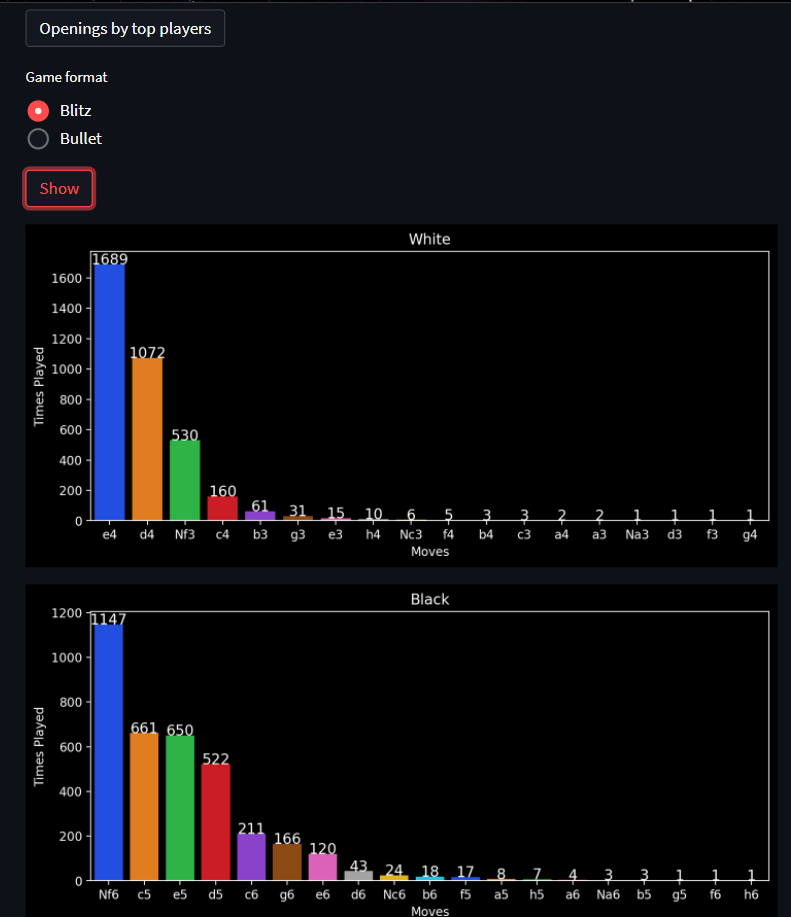
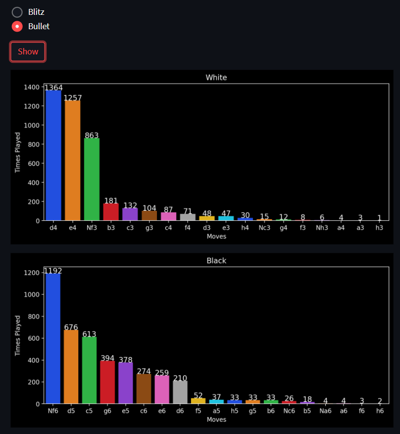
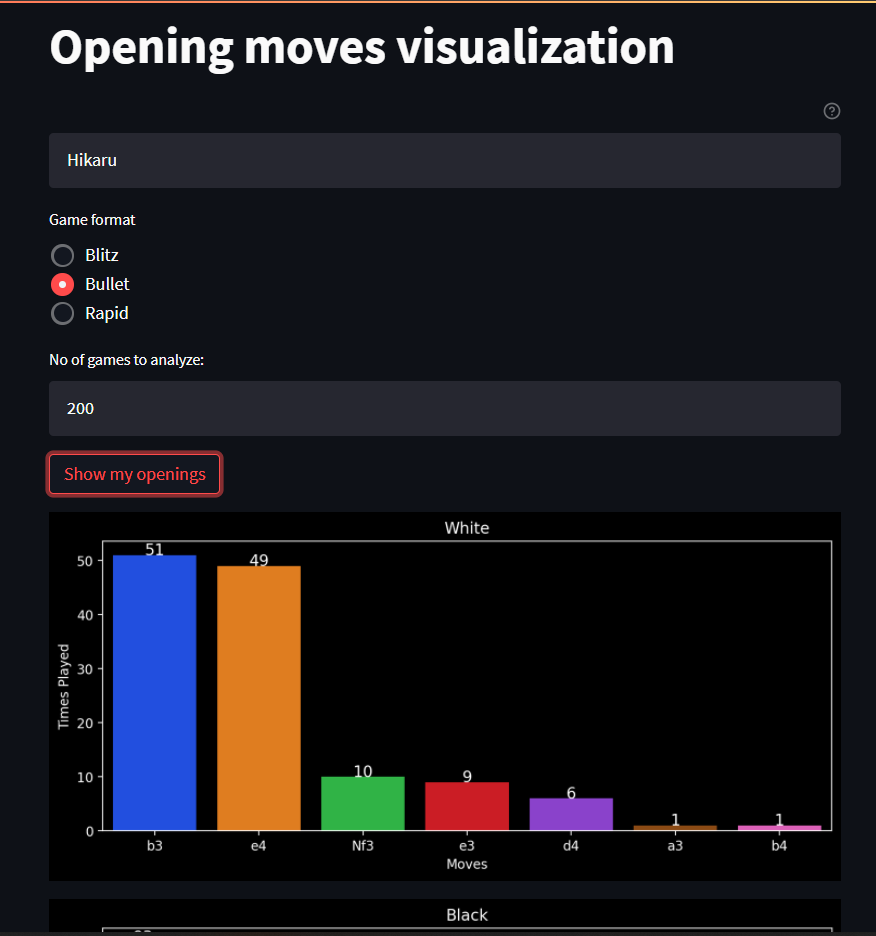
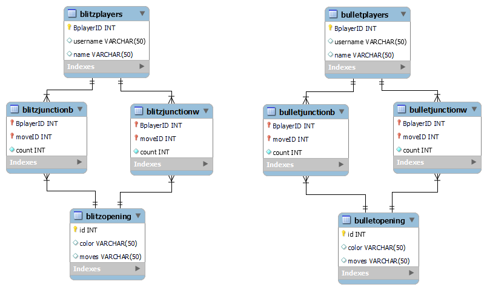

# What are the most played opening moves by the top players in chess?

Ever wondered if the top players play more e4 or d4 as white? Nf6 or c5 as black? \
Well, that is the purpose of this project. Not only for the top players you can also analyze your own games on chess.com to find the graphical representation of your opening move choices as white and black.

## Table Of Contents

1. [What I did](#what-i-did)
2. [What did I get](#What-did-I-get)
3. [How to do the same](#how-to-do-the-same)
    - [Requirements](#requirements)
    - [Get records](#get-records)
    - [Visualize](#visualize)
4. [Database structure](#database-structure)
5. [Contributing](#contributing)
6. [License](#license)

## What I did

1. Fetched the data from [chess.com api](https://www.chess.com/news/view/published-data-api)
2. Created a top players database using the leaderboard data from the api
3. Collected the game data for those players, from where opening moves are obtained
4. Analyzed and visualized the data on a streamlit app
5. For the username you provide, data is fetched similarly and visualized

## What did I get
Here I have analyzed min 100 games per player. We can see that the top players prefer e4 as white and Nf6 as black in the blitz games.



For the bullet games we have d4 as a preferred opening from white and Nf6 still remains the most played.



I would like to point out that out of the top 50 players provided by the leaderboard, many players haven't played a lot of games(some only play important online tournaments and don't play casual online chess ), so the results could have a bias towards those players that have played more games. Ex- GM Hikaru has played a lot of games, but GM Ding Liren hasn't played much. But most players have atleast 100 games, that's why I have only fetched 100 games per player.


## How to do the same
### Requirements
- I have used [MySQL](https://www.mysql.com/) for making the database and the [mysql connector](https://pypi.org/project/mysql-connector-python/) is used to running SQL queries on the database. So set up the MySQL server by [downloading](https://dev.mysql.com/downloads/installer/) it and setting up your credentials for a local server.
- For the required libraries
```bash
pip install -r requirements.txt
```
### Get records
In the database_setup.py create a database and enter the credentials you set up for the local MySQL server. \
Run the getrecords.py which will fetch the data from the api and put the relevant data in the database.
### Visualize
To visualize the data obtained, run the streamlit app from the terminal as follows
```bash
streamlit run app.py
```
For visualizing the opening data for a particular chess.com username, you can directly run the streamlit app and no need for setting up of MySQL.



## Database structure
There are 4 tables each for the data of blitz and bullet game formats.



Let us look at the blitz(same is for the bullet) tables.
- The top players in blitz format is stored in _blitzplayers_ table, which is obtained from the [leaderboard](https://api.chess.com/pub/leaderboards) by chess.com api. It includes their username and name.
- _blitzopening_ table contains all the unique opening moves fetched when games of the players were accessed. It has the move name and the color from which it was played (black or white)
- _blitzjunctionw_ and _blitzjunctionb_ are the joint tables for white and black color. It includes the blitz player id, move id from _blitzplayers_ and _blitzopening_ tables respectively.  There is also a count column specifying the count of the respective move.


## Contributing
Pull requests are welcome. For major changes, please open an issue first to discuss what you would like to change.

## License
[MIT](https://choosealicense.com/licenses/mit/)
